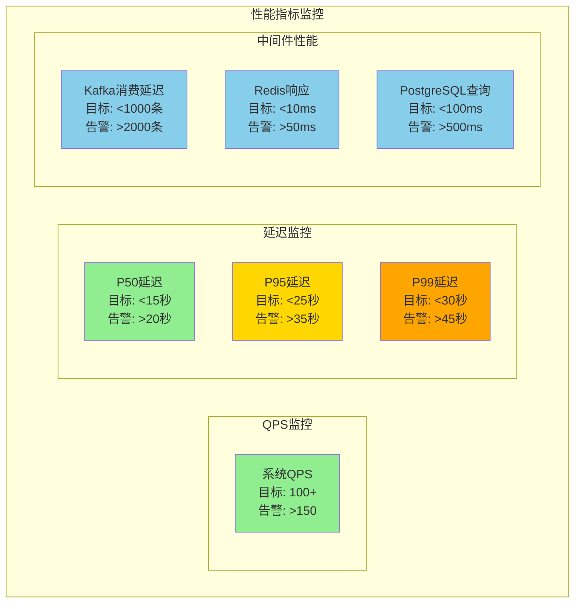
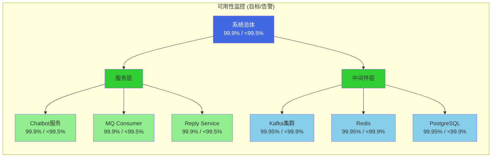
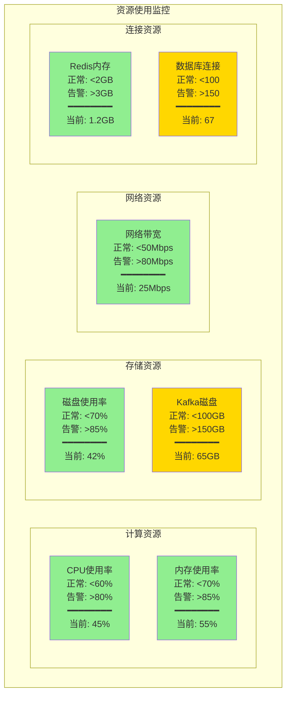
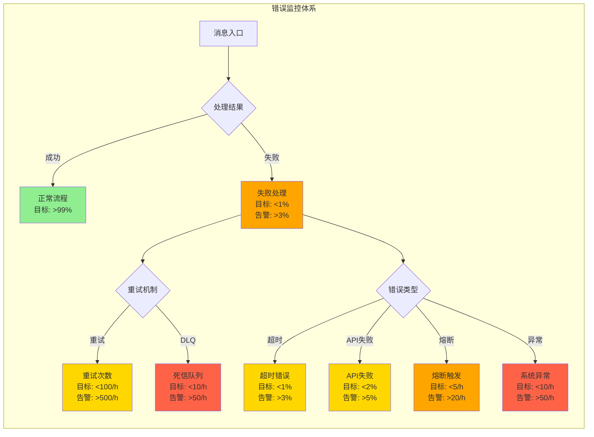
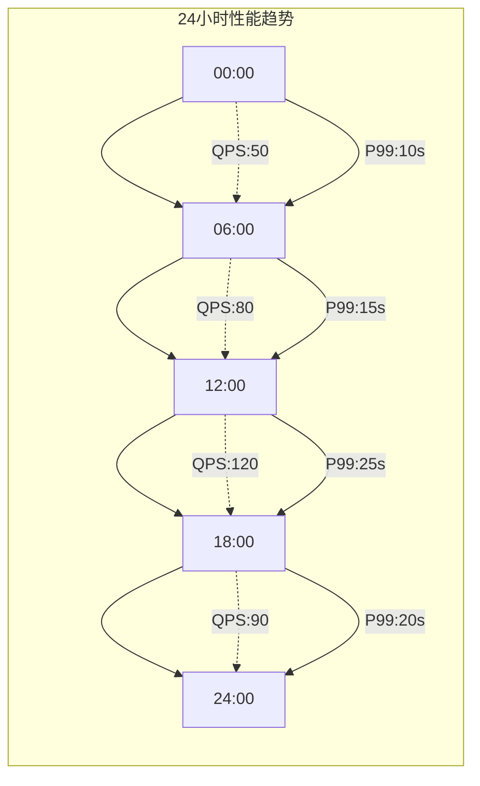
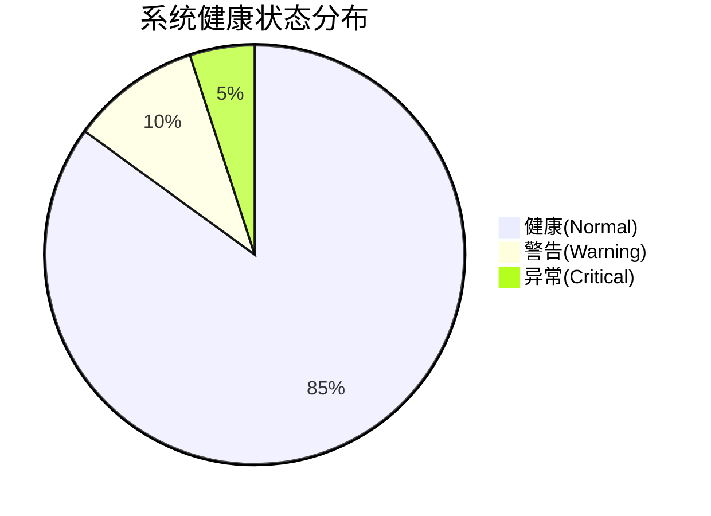
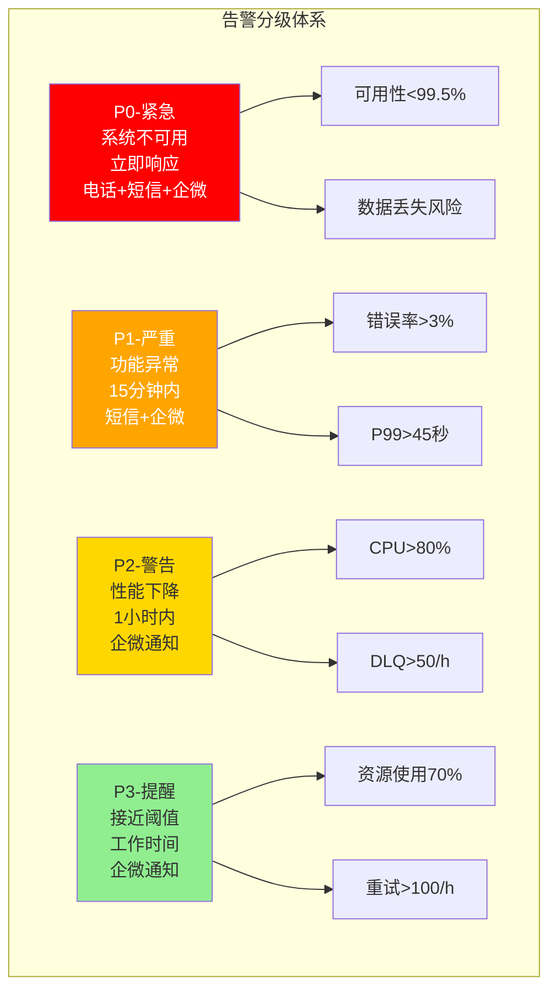
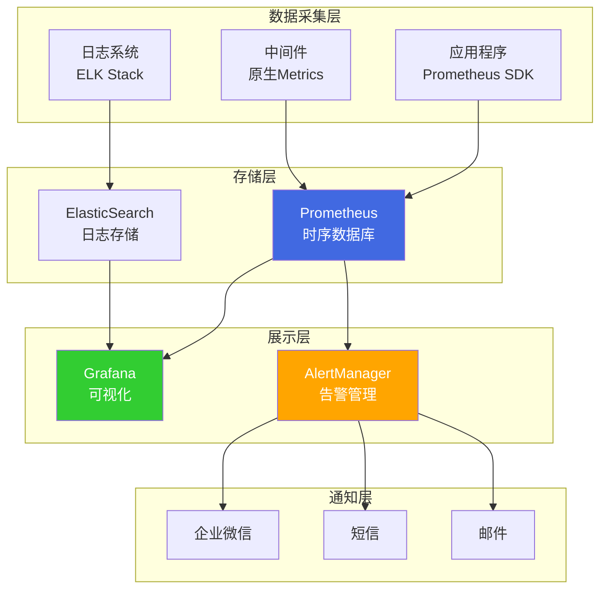
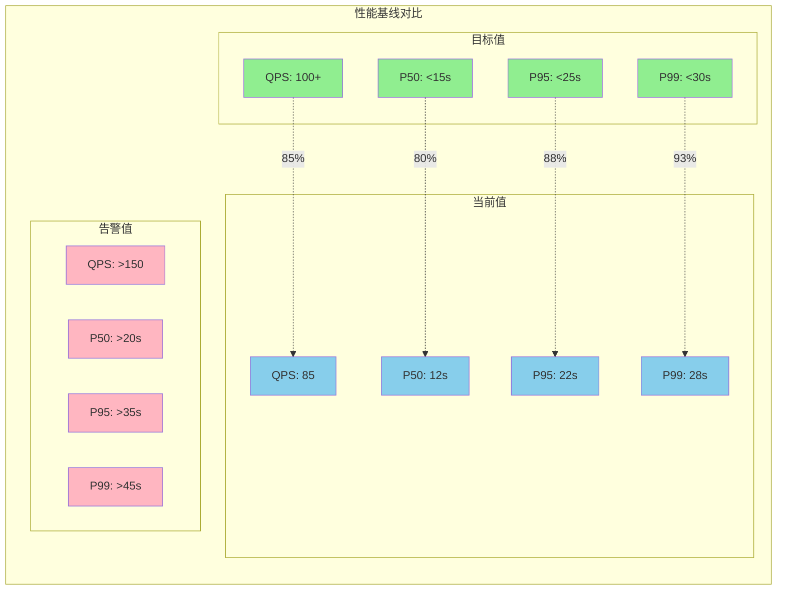
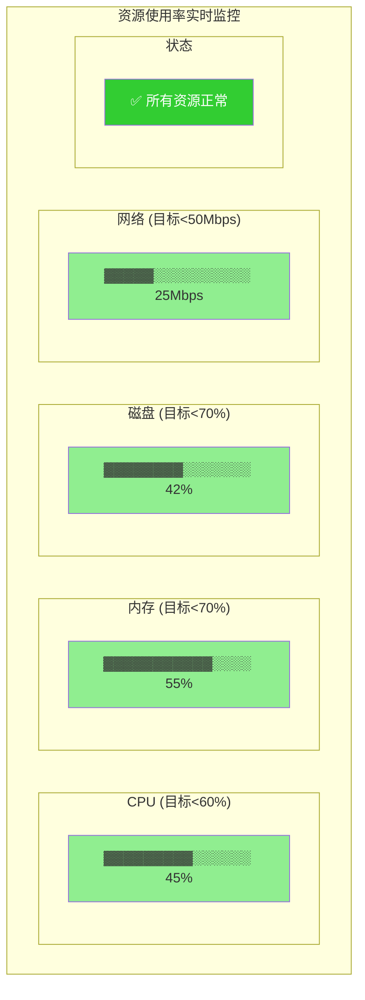

# 企微智能机器人系统指标Mermaid图表

## 1. 性能指标仪表盘

## 2. 可用性指标雷达图

## 3. 资源使用率监控

## 4. 错误与异常指标流程图

## 5. 性能指标趋势图

## 6. 系统健康状态总览

## 7. 告警级别分布

## 8. 监控数据流向图

## 9. 性能基线对比

## 10. 资源使用率仪表盘

## 说明

这些Mermaid图表展示了企微智能机器人系统的关键监控指标：

1. **性能指标仪表盘** - 展示QPS、延迟分位数和中间件性能
2. **可用性指标雷达图** - 展示服务和中间件的可用性目标
3. **资源使用率监控** - 实时展示各类资源的使用情况
4. **错误与异常流程图** - 展示错误处理和监控流程
5. **性能趋势图** - 24小时性能变化趋势
6. **健康状态饼图** - 系统整体健康状态分布
7. **告警分级体系** - P0-P3告警级别和触发条件
8. **监控数据流向** - 从采集到通知的完整链路
9. **性能基线对比** - 目标值、当前值、告警值对比
10. **资源使用率仪表盘** - 直观的资源使用率展示

这些图表可以直接嵌入到监控大屏或文档中，提供直观的系统状态可视化。