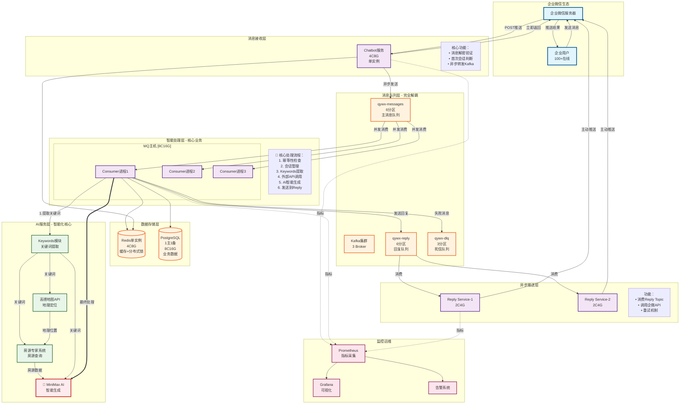
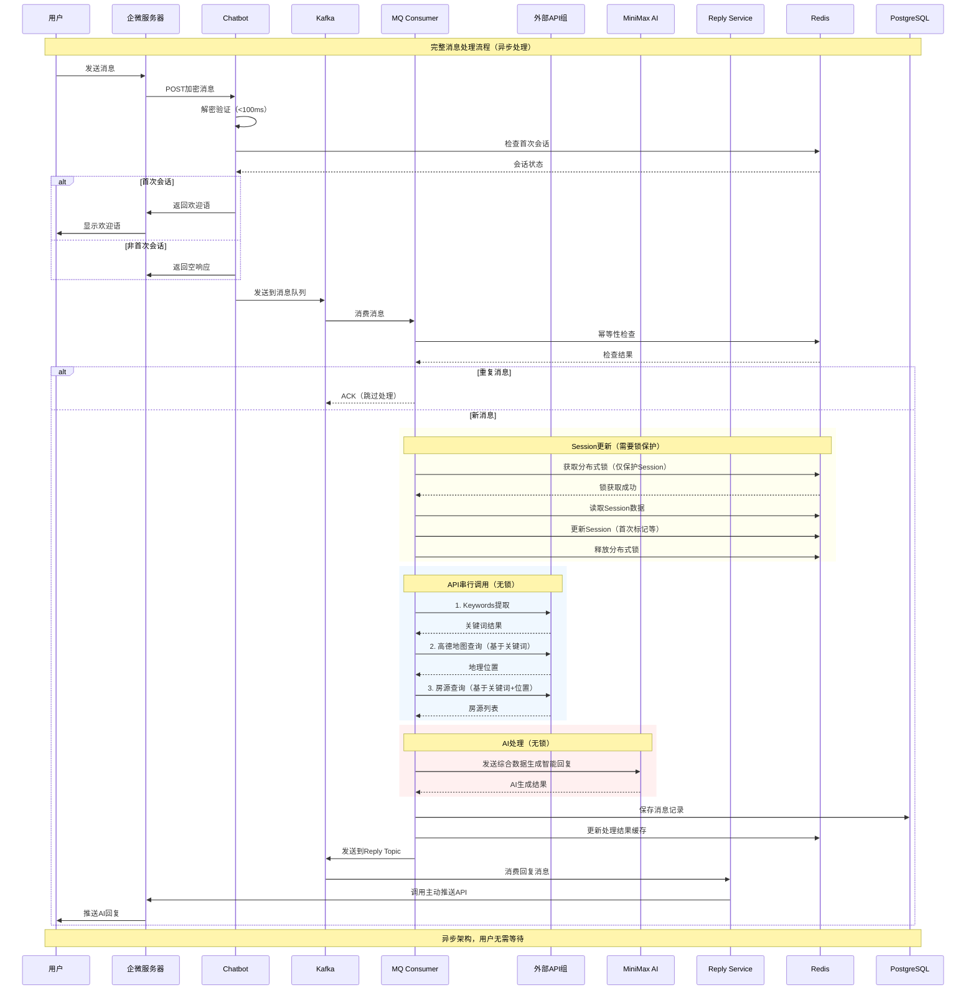
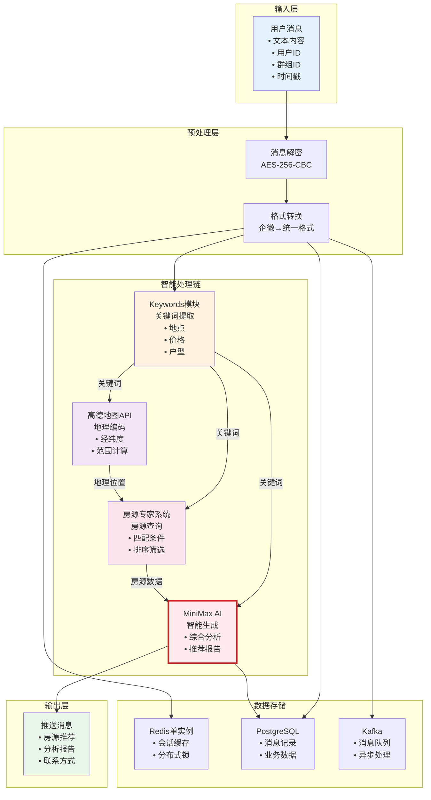
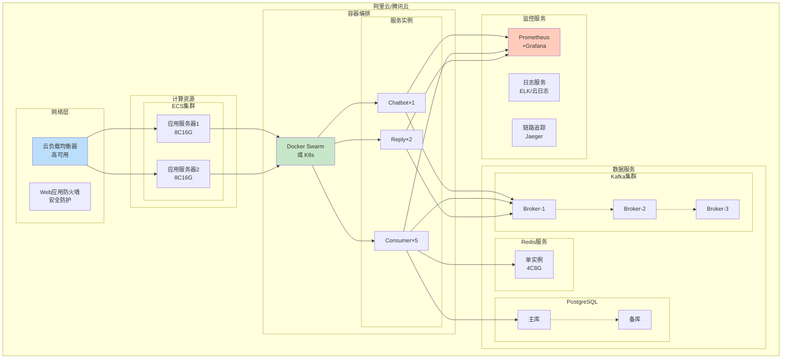
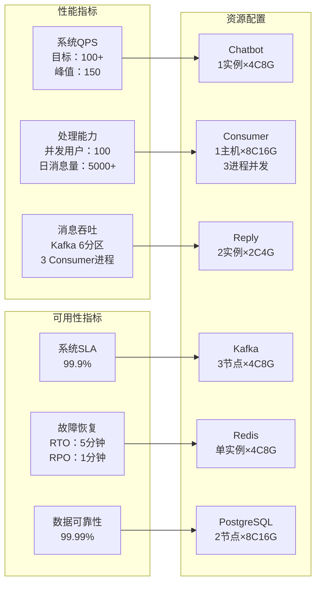
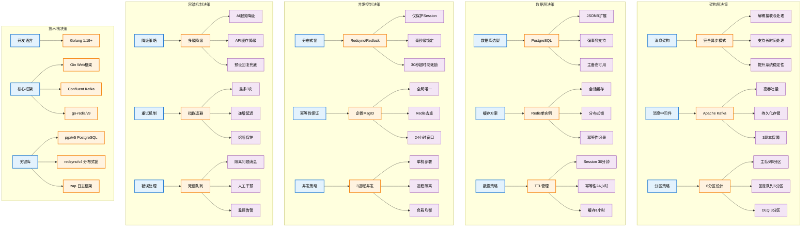
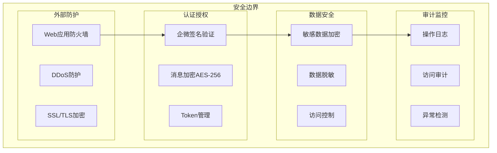
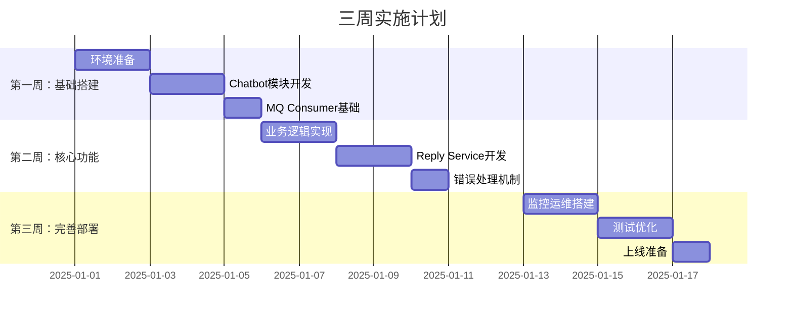

# 企微智能房产推荐机器人系统架构图

> 用于客户Presentation的详细系统架构说明文档
> 生成日期：2025-08-21
> 目标规模：100+ QPS，100人同时在线

## 1. 核心设计理念

### 🎯 四大核心理念

#### 1️⃣ **极简入口设计**
- **单Chatbot实例**：去除不必要的负载均衡，100 QPS规模单实例足够
- **快速响应**：接收即返回，不阻塞企微回调
- **轻量化**：仅负责解密、验证、转发，业务逻辑完全解耦

#### 2️⃣ **完全异步架构**
- **消息队列解耦**：Kafka作为核心中枢，实现接收与处理完全分离
- **无阻塞设计**：支持长时间AI处理，用户无需等待
- **弹性伸缩**：Consumer可独立扩展，不影响接收层

#### 3️⃣ **智能处理链**
- **单主机3进程并发**：同一台8C16G主机运行3个Consumer进程，充分利用多核
- **API串行依赖**：Keywords→高德地图/房源查询→MiniMax AI，数据逐层增强
- **AI输入优化**：汇聚关键词+房源数据，生成精准推荐

#### 4️⃣ **主动推送模式**
- **Reply Service独立**：专门负责消息推送，与处理逻辑解耦
- **重试机制**：失败自动重试，保证消息可达
- **异步通知**：处理完成后主动推送，用户体验更好

### 🏗️ 架构设计原则

| 原则 | 说明 | 实现方式 |
|------|------|----------|
| **简单性** | 避免过度设计 | 单Chatbot、去除Nginx |
| **解耦性** | 模块职责清晰 | Kafka消息队列隔离 |
| **可靠性** | 保证消息不丢失 | 3副本、幂等性、重试 |
| **扩展性** | 支持未来增长 | Consumer可独立扩展 |
| **成本效益** | 优化资源使用 | 精简配置，月成本6900元 |

### 🔒 分布式锁使用说明

**重要**：分布式锁仅用于保护Session更新操作，不包括API调用和AI处理
- **需要锁**：Session读取和更新（毫秒级操作）
- **不需要锁**：Keywords提取、地图查询、房源查询、AI生成（这些都是无状态操作）
- **锁粒度**：用户级别，确保同一用户的Session不会并发更新
- **锁时间**：实际持有时间仅几毫秒，超时设置30秒仅为防止死锁

## 2. 系统全景架构图

## 3. 消息处理时序图

## 4. 数据流向图

## 5. 部署架构图

## 6. 系统性能指标

## 7. 关键技术决策

## 8. 安全架构

## 9. 成本效益分析

| 项目 | 配置 | 月成本(元) | 说明 |
|------|------|------------|------|
| **计算资源** | | | |
| Chatbot服务器 | 1台×4C8G | 500 | 消息接收 |
| Consumer服务器 | 1台×8C16G | 1,000 | 3进程并行处理 |
| Reply服务器 | 1台×4C8G | 500 | 消息推送 |
| **存储资源** | | | |
| 云数据库PostgreSQL | 8C16G高可用版 | 1,200 | 业务数据 |
| 云数据库Redis | 4C8G单实例 | 400 | 缓存服务 |
| Kafka消息队列 | 3节点集群 | 1,500 | 消息中间件 |
| **网络资源** | | | |
| 公网带宽 | 50Mbps | 500 | 数据传输 |
| **外部服务** | | | |
| MiniMax AI | 按调用量 | 2,000 | AI生成 |
| 高德地图API | 按调用量 | 300 | 地理服务 |
| **总计** | | **6,900** | 预估月成本 |

## 10. 项目实施路线图

## 11. 演示要点总结

### 核心亮点
1. **完全异步架构**：支持长时间AI处理，用户体验流畅
2. **智能房产推荐**：集成多个外部API，提供精准推荐
3. **高可用设计**：多实例部署，99.9% SLA保障
4. **成本优化**：极简部署，月成本仅6900元

### 技术优势
1. **成熟技术栈**：Golang + Kafka + Redis + PostgreSQL
2. **容错机制完善**：降级、重试、熔断三重保障
3. **监控体系完整**：Prometheus + Grafana实时监控
4. **易于扩展**：可平滑升级到更大规模

### 业务价值
1. **用户体验提升**：智能对话，精准推荐
2. **运营效率提高**：自动化处理，减少人工
3. **数据驱动决策**：完整的数据采集和分析
4. **快速落地**：3周即可完成开发部署

---

> 本文档用于客户Presentation，包含完整的系统架构设计和实施方案